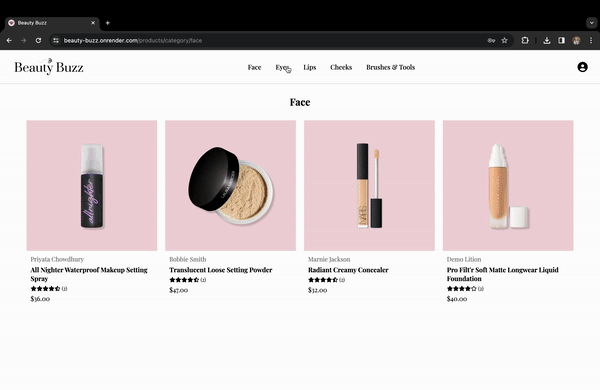
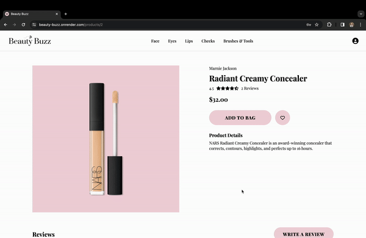
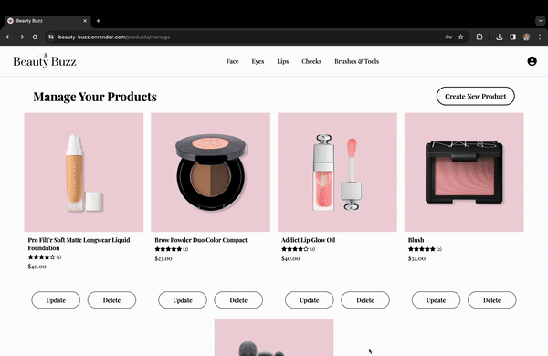

# Beauty Buzz

Beauty Buzz is an ecommerce site inspired by Ulta and Etsy. On this site, makeup enthusiasts can list their own makeup products and review makeup products that others have shared. Some features to be expected in the future are Shopping Cart and Favorites.

# Live Link

https://beauty-buzz.onrender.com

# Tech Stack

### Languages

### Frameworks and Libraries

### ORM

### Database

### Hosting

### Object Storage

### Design

# Index

[Feature List](https://github.com/nicolehuyen/Beauty-Buzz/wiki/MVP's-Feature-List#mvps-feature-list) | [Database Schema](https://github.com/nicolehuyen/Beauty-Buzz/wiki/Database-Schema-and-Backend-Routes#database-schema) | [User Stories](https://github.com/nicolehuyen/Beauty-Buzz/wiki/User-Stories) | [Wireframes](https://github.com/nicolehuyen/Beauty-Buzz/wiki/Wireframes)

# Landing Page

# User Login / Sign-Up

# Categories

# Product Details

# Manage Products

# Endpoints

### Auth

| **Request**                | **Purpose**                                                                                                                                                                | **Return Value**                                                                                                            |
|----------------------------|----------------------------------------------------------------------------------------------------------------------------------------------------------------------------|-----------------------------------------------------------------------------------------------------------------------------|
| GET /api/auth/             | This fetch returns an object representing the current user if they are logged in.                                                                                          | {  "email": STRING,  "first_name": STRING,  "id": INTEGER,  "last_name": STRING  }    Status: 200      |
| GET /api/auth/unauthorized | This route returns an object with the message 'Unauthorized' if authentication fails.                                                                                      | {  "errors": {"message":  "Unauthorized"}  }    Status: 401                                                     |
| POST /api/auth/signup      | This fetch sends the form data to the back end to process the creation of a new user. It returns an object representing the current user if the account creation succeeds. | {  "email": STRING,  "first_name": STRING,  "id": INTEGER,  "last_name": STRING  }    Status: 200      |
| POST /api/auth/login       | This fetch sends the form data to the back end to process the login of a user. It returns an object representing the current user if the account login succeeds.           | {   "email": STRING,   "first_name": STRING,   "id": INTEGER,   "last_name": STRING   }    Status: 200 |
| GET /api/auth/logout       | This fetch will log out the current user. It returns an object with the message 'User logged out' if it succeeds.                                                          | {  "message": "User logged out"  }    Status: 200                                                               |

### Product

| **Request**                      | **Purpose**                                                                                                                                                          | **Return Value**                                                                                                                                                                                                                                                                                                                                                    |
|----------------------------------|----------------------------------------------------------------------------------------------------------------------------------------------------------------------|---------------------------------------------------------------------------------------------------------------------------------------------------------------------------------------------------------------------------------------------------------------------------------------------------------------------------------------------------------------------|
| GET /api/products/               | This fetch returns an object representing all the makeup products.                                                                                                   | {   "products": [     {      "category": STRING,      "created_at": DATETIME,      "description": STRING,      "id": INTEGER,      "image": STRING,      "name": STRING,      "price": NUMERIC,      "reviews": [],       "seller_id": INTEGER,       "updated_at": DATETIME       } ]   }    Status: 200           |
| GET /api/products/:id            | This fetch returns an object representing a single makeup product.                                                                                                   | {       "category": STRING,      "created_at": DATETIME,      "description": STRING,      "id": INTEGER,      "image": STRING,      "name": STRING,      "price": NUMERIC,      "reviews": [],       "seller_id": INTEGER,       "updated_at": DATETIME   }    Status: 200                                                   |
| GET /api/products/category/:cate | This fetch returns an object representing all the makeup products in a specific category.                                                                            | {   "product_categories": [     {      "category": STRING,      "created_at": DATETIME,      "description": STRING,      "id": INTEGER,      "image": STRING,      "name": STRING,      "price": NUMERIC,      "reviews": [],       "seller_id": INTEGER,       "updated_at": DATETIME       } ]   }    Status: 200 |
| GET /api/products/manage         | This fetch returns an object representing all the makeup products that the current user owns.                                                                        | {   "user_products": [     {      "category": STRING,      "created_at": DATETIME,      "description": STRING,      "id": INTEGER,      "image": STRING,      "name": STRING,      "price": NUMERIC,      "reviews": [],       "seller_id": INTEGER,       "updated_at": DATETIME       } ]   }    Status: 200      |
| POST /api/products/new           | This fetch sends the form data to the back end to process the creation of a new product. It returns an object representing the new product if the creation succeeds. | {      "category": STRING,      "created_at": DATETIME,      "description": STRING,      "id": INTEGER,      "image": STRING,      "name": STRING,      "price": NUMERIC,      "reviews": [],       "seller_id": INTEGER,       "updated_at": DATETIME   }    Status: 200                                                    |
| PUT /api/products/:id/edit       | This fetch sends the form data to the back end to process the update of a product. It returns an object representing the updated product if the update succeeds.     | {      "category": STRING,      "created_at": DATETIME,      "description": STRING,      "id": INTEGER,      "image": STRING,      "name": STRING,      "price": NUMERIC,      "reviews": [],       "seller_id": INTEGER,       "updated_at": DATETIME   }    Status: 200                                                    |
| DELETE /api/products/:id         | This fetch will delete the product. It returns a message 'Successfully Deleted' if it succeeds.                                                                      | Successfully Deleted    Status: 200                                                                                                                                                                                                                                                                                                                           |

### Review

| **Request**                                | **Purpose**                                                                                                                                                        | **Return Value**                                                                                                                                                                                                                                                               |
|--------------------------------------------|--------------------------------------------------------------------------------------------------------------------------------------------------------------------|--------------------------------------------------------------------------------------------------------------------------------------------------------------------------------------------------------------------------------------------------------------------------------|
| GET /api/products/:id/reviews              | This fetch returns an object representing all the makeup product's reviews.                                                                                        | {   "reviews": [     {      "created_at": DATETIME,      "creator_id": INTEGER,      "id": INTEGER,      "product_id": INTEGER,      "review": STRING,      "stars": INTEGER,       "updated_at": DATETIME       } ]   }    Status: 200 |
| POST /api/products/:id/reviews             | This fetch sends the form data to the back end to process the creation of a new review. It returns an object representing the new review if the creation succeeds. | {       "created_at": DATETIME,      "creator_id": INTEGER,      "id": INTEGER,      "product_id": INTEGER,      "review": STRING,      "stars": INTEGER,       "updated_at": DATETIME   }    Status: 200                                        |
| PUT /api/products/:id/reviews/:reviewId    | This fetch sends the form data to the back end to process the update of a review. It returns an object representing the updated review if the update succeeds.     | {       "created_at": DATETIME,      "creator_id": INTEGER,      "id": INTEGER,      "product_id": INTEGER,      "review": STRING,      "stars": INTEGER,       "updated_at": DATETIME   }    Status: 200                                        |
| DELETE /api/products/:id/reviews/:reviewId | This fetch will delete the review. It returns a message 'Successfully Deleted' if it succeeds.                                                                     | Successfully Deleted    Status: 200                                                                                                                                                                                                                                      |

# Feature List

1. Products
2. Reviews

# Future Features

1. Shopping Cart
2. Favorites
3. Search
4. Past Orders / Reorder

# Connect

[LinkedIn](https://www.linkedin.com/in/nicolehuyenle/) | [GitHub](https://github.com/nicolehuyen)
